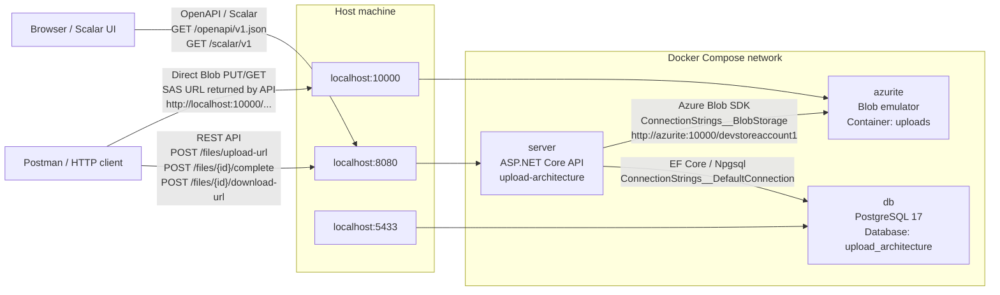
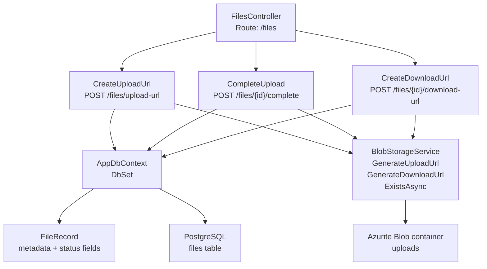
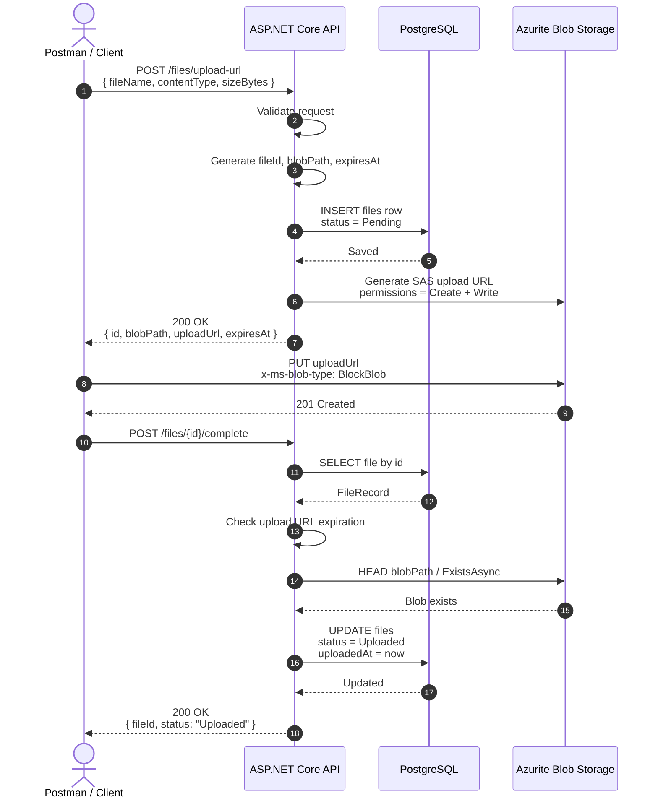
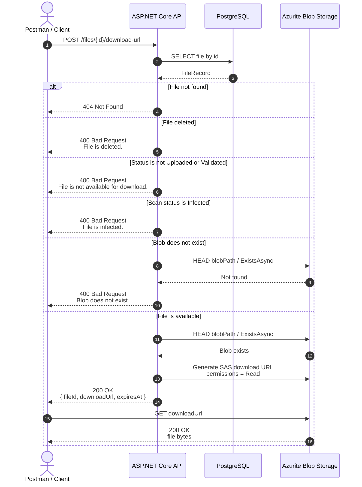
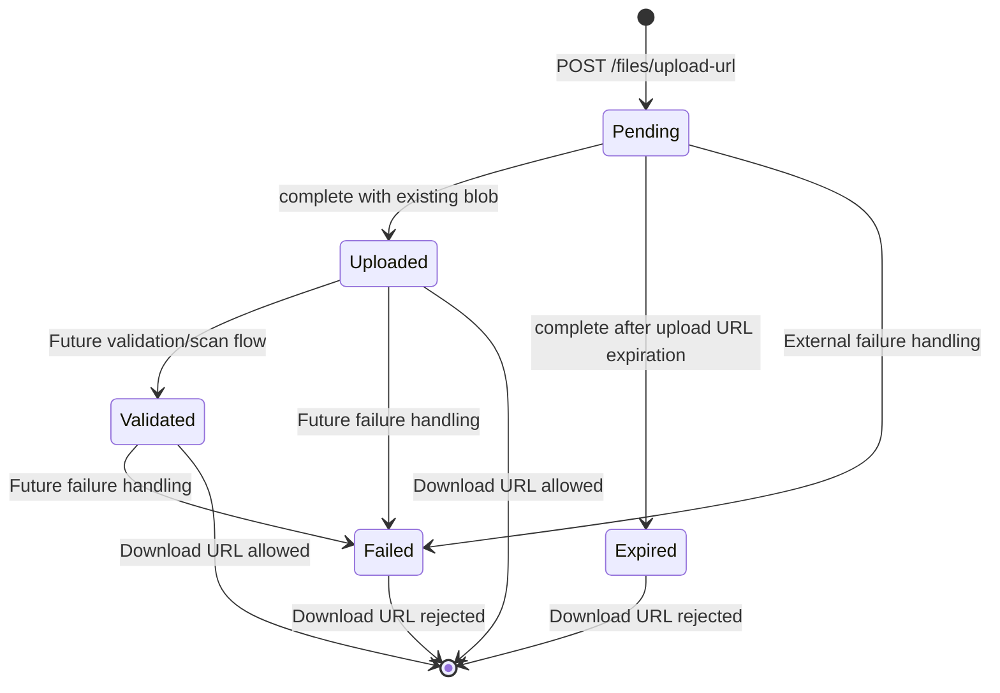
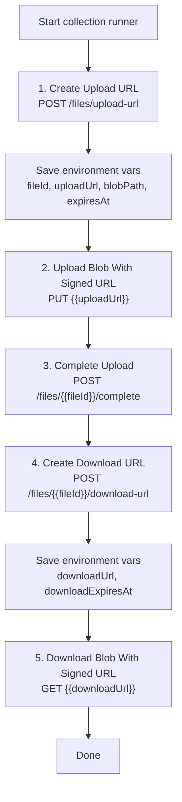

# Upload Architecture - Architecture and Flows

## Docker Architecture

```mermaid
flowchart LR
    postman["Postman / HTTP client"]
    browser["Browser / Scalar UI"]

    subgraph host["Host machine"]
        apiPort["localhost:8080"]
        azuritePort["localhost:10000"]
        postgresPort["localhost:5433"]
    end

    subgraph docker["Docker Compose network"]
        api["server\nASP.NET Core API\nupload-architecture"]
        db["db\nPostgreSQL 17\nDatabase: upload_architecture"]
        azurite["azurite\nBlob emulator\nContainer: uploads"]
    end

    postman -->|"REST API\nPOST /files/upload-url\nPOST /files/{id}/complete\nPOST /files/{id}/download-url"| apiPort
    browser -->|"OpenAPI / Scalar\nGET /openapi/v1.json\nGET /scalar/v1"| apiPort
    apiPort --> api

    api -->|"EF Core / Npgsql\nConnectionStrings__DefaultConnection"| db
    api -->|"Azure Blob SDK\nConnectionStrings__BlobStorage\nhttp://azurite:10000/devstoreaccount1"| azurite

    postman -->|"Direct Blob PUT/GET\nSAS URL returned by API\nhttp://localhost:10000/..."| azuritePort
    azuritePort --> azurite
    postgresPort --> db
```

## API Components

```mermaid
flowchart TB
    filesController["FilesController\nRoute: /files"]
    createUpload["CreateUploadUrl\nPOST /files/upload-url"]
    completeUpload["CompleteUpload\nPOST /files/{id}/complete"]
    createDownload["CreateDownloadUrl\nPOST /files/{id}/download-url"]

    dbContext["AppDbContext\nDbSet<FileRecord>"]
    fileRecord["FileRecord\nmetadata + status fields"]
    blobService["BlobStorageService\nGenerateUploadUrl\nGenerateDownloadUrl\nExistsAsync"]

    postgres["PostgreSQL\nfiles table"]
    blobContainer["Azurite Blob container\nuploads"]

    filesController --> createUpload
    filesController --> completeUpload
    filesController --> createDownload

    createUpload --> dbContext
    completeUpload --> dbContext
    createDownload --> dbContext

    createUpload --> blobService
    completeUpload --> blobService
    createDownload --> blobService

    dbContext --> fileRecord
    dbContext --> postgres
    blobService --> blobContainer
```

## Upload Flow

```mermaid
sequenceDiagram
    autonumber
    actor Client as Postman / Client
    participant API as ASP.NET Core API
    participant DB as PostgreSQL
    participant Blob as Azurite Blob Storage

    Client->>API: POST /files/upload-url<br/>{ fileName, contentType, sizeBytes }
    API->>API: Validate request
    API->>API: Generate fileId, blobPath, expiresAt
    API->>DB: INSERT files row<br/>status = Pending
    DB-->>API: Saved
    API->>Blob: Generate SAS upload URL<br/>permissions = Create + Write
    API-->>Client: 200 OK<br/>{ id, blobPath, uploadUrl, expiresAt }

    Client->>Blob: PUT uploadUrl<br/>x-ms-blob-type: BlockBlob
    Blob-->>Client: 201 Created

    Client->>API: POST /files/{id}/complete
    API->>DB: SELECT file by id
    DB-->>API: FileRecord
    API->>API: Check upload URL expiration
    API->>Blob: HEAD blobPath / ExistsAsync
    Blob-->>API: Blob exists
    API->>DB: UPDATE files<br/>status = Uploaded<br/>uploadedAt = now
    DB-->>API: Updated
    API-->>Client: 200 OK<br/>{ fileId, status: "Uploaded" }
```

## Download URL Flow

```mermaid
sequenceDiagram
    autonumber
    actor Client as Postman / Client
    participant API as ASP.NET Core API
    participant DB as PostgreSQL
    participant Blob as Azurite Blob Storage

    Client->>API: POST /files/{id}/download-url
    API->>DB: SELECT file by id
    DB-->>API: FileRecord

    alt File not found
        API-->>Client: 404 Not Found
    else File deleted
        API-->>Client: 400 Bad Request<br/>File is deleted.
    else Status is not Uploaded or Validated
        API-->>Client: 400 Bad Request<br/>File is not available for download.
    else Scan status is Infected
        API-->>Client: 400 Bad Request<br/>File is infected.
    else Blob does not exist
        API->>Blob: HEAD blobPath / ExistsAsync
        Blob-->>API: Not found
        API-->>Client: 400 Bad Request<br/>Blob does not exist.
    else File is available
        API->>Blob: HEAD blobPath / ExistsAsync
        Blob-->>API: Blob exists
        API->>Blob: Generate SAS download URL<br/>permissions = Read
        API-->>Client: 200 OK<br/>{ fileId, downloadUrl, expiresAt }
        Client->>Blob: GET downloadUrl
        Blob-->>Client: 200 OK<br/>file bytes
    end
```

## File State Flow

```mermaid
stateDiagram-v2
    [*] --> Pending: POST /files/upload-url

    Pending --> Uploaded: complete with existing blob
    Pending --> Expired: complete after upload URL expiration
    Pending --> Failed: External failure handling

    Uploaded --> Validated: Future validation/scan flow
    Uploaded --> Failed: Future failure handling
    Validated --> Failed: Future failure handling

    Uploaded --> [*]: Download URL allowed
    Validated --> [*]: Download URL allowed
    Expired --> [*]: Download URL rejected
    Failed --> [*]: Download URL rejected
```

## Postman Runner Flow

```mermaid
flowchart TD
    start["Start collection runner"]
    uploadUrl["1. Create Upload URL\nPOST /files/upload-url"]
    saveUploadVars["Save environment vars\nfileId, uploadUrl, blobPath, expiresAt"]
    uploadBlob["2. Upload Blob With Signed URL\nPUT {{uploadUrl}}"]
    complete["3. Complete Upload\nPOST /files/{{fileId}}/complete"]
    downloadUrl["4. Create Download URL\nPOST /files/{{fileId}}/download-url"]
    saveDownloadVars["Save environment vars\ndownloadUrl, downloadExpiresAt"]
    downloadBlob["5. Download Blob With Signed URL\nGET {{downloadUrl}}"]
    done["Done"]

    start --> uploadUrl
    uploadUrl --> saveUploadVars
    saveUploadVars --> uploadBlob
    uploadBlob --> complete
    complete --> downloadUrl
    downloadUrl --> saveDownloadVars
    saveDownloadVars --> downloadBlob
    downloadBlob --> done
```
